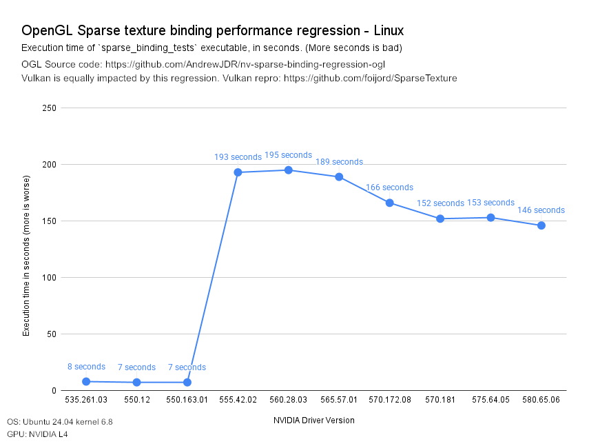

## Sparse binding performance regression in NVIDIA drivers 555 -> 575 (Linux)

There is a serious performance regression with sparse binding using Vulkan or OpenGL on Linux with the NVIDIA 555, 560, 565, 570, and 575 driver series as compared to the NVIDIA 535 and 550 driver series. In OpenGL terms, the `glTexturePageCommitmentEXT` function has become much, much slower than it used to be. The earliest emergence of the regression seems to have been with the 555.42.02 driver released on 2024-05-21.



This repository contains a minimal repro and results for the OpenGL issue. For a repro and results for the corresponding Vulkan issue, please see https://github.com/foijord/SparseTexture and scroll down to view the Linux charts.

To repro:
1. Install either the 575.64.05 or 570.172.08 driver on Linux. For my tests, I've used Ubuntu 24.04 with the 6.8 kernel an NVIDIA L4 GPU.
2. Clone this repo.
3. Run `./build.sh`
4. Run `./sparse-binding-tests`

Per commit\* and per evict\* timings will be printed with a summary at the end. Note that for 570/575 series drivers, the total runtime will likely be on the order of 2-3 minutes, because **The runtime of each `glTexturePageCommitmentEXT` call increases as more calls are made, reaching as high as 1.7ms per call!**

Re-run the test with 550 series driver such as 550.163.01 or 550.120. The total runtime will likely be around 5-6 seconds, because **the runtime of each `glTexturePageCommitmentEXT` call remains constantly below 0.1ms, even as more calls are made.**

\* "commit" and "evict" in this context simply refers to calling `glTexturePageCommitmentEXT` with either `true` or `false` for the last argument, respectively.

Because the per commit/evict performance worsens as more calls are made, the performance disparity between 550 and 570/575 driver grows with even larger batches. See the linux charts for the vulkan repro of this issue at https://github.com/foijord/SparseTexture for results reaching as much as 800x slower on 570 vs 550 after many bind (commit) calls are made.

### Summary results:

All tests below were run on the same machine with the same GPU (NVIDIA L4) and the same distro+kernel (Ubuntu 24.04, kernel 6.8.0). Only the driver was changed.

Kernel 6.14 was also tested but it made no difference, so those results aren't included here.

#### NVIDIA driver 575.64.05
```
TOTAL COMMITS: 87040
TOTAL EVICTS: 87040
TOTAL COMMIT TIME: 68810.126449ms
TOTAL EVICT TIME: 83838.565101ms
TOTAL TIME (commit + evict): 152648.691550ms
```

#### NVIDIA driver 570.172.08
```
TOTAL COMMITS: 87040
TOTAL EVICTS: 87040
TOTAL COMMIT TIME: 80655.537682ms
TOTAL EVICT TIME: 85791.870631ms
TOTAL TIME (commit + evict): 166447.408313ms
```

#### NVIDIA driver 565.57.01
```
TOTAL COMMITS: 87040
TOTAL EVICTS: 87040
TOTAL COMMIT TIME: 92757.773312ms
TOTAL EVICT TIME: 96164.332830ms
TOTAL TIME (commit + evict): 188922.106142ms
```

#### NVIDIA driver 560.28.03
```
TOTAL COMMITS: 87040
TOTAL EVICTS: 87040
TOTAL COMMIT TIME: 97073.389938ms
TOTAL EVICT TIME: 98100.633168ms
TOTAL TIME (commit + evict): 195174.023106ms
```

#### NVIDIA driver 555.42.02
```
TOTAL COMMITS: 87040
TOTAL EVICTS: 87040
TOTAL COMMIT TIME: 94594.364440ms
TOTAL EVICT TIME: 98503.997579ms
TOTAL TIME (commit + evict): 193098.362019ms
```

#### NVIDIA driver 550.163.01
```
TOTAL COMMITS: 87040
TOTAL EVICTS: 87040
TOTAL COMMIT TIME: 5631.503256ms
TOTAL EVICT TIME: 1666.693172ms
TOTAL TIME (commit + evict): 7298.196428ms
```

#### NVIDIA driver 550.120
```
TOTAL COMMITS: 87040
TOTAL EVICTS: 87040
TOTAL COMMIT TIME: 5598.830712ms
TOTAL EVICT TIME: 1679.146495ms
TOTAL TIME (commit + evict): 7277.977207ms
```

#### NVIDIA driver 535.261.03
```
TOTAL COMMITS: 87040
TOTAL EVICTS: 87040
TOTAL COMMIT TIME: 5952.291026ms
TOTAL EVICT TIME: 1805.416670ms
TOTAL TIME (commit + evict): 7757.707696ms
```

#### Bonus round: NVIDIA RTX 5090 with driver 570.153.02
I rented an NVIDIA GeForce RTX 5090 to run the test on in hopes of a Blackwell-only architectural improvement that mitigates the regression. Unfortunately my hopes were dashed. The regression occurs on this configuration as well:
```
TOTAL COMMITS: 87040
TOTAL EVICTS: 87040
TOTAL COMMIT TIME: 52665.861477ms
TOTAL EVICT TIME: 58093.957368ms
TOTAL TIME (commit + evict): 110759.818845ms
```
